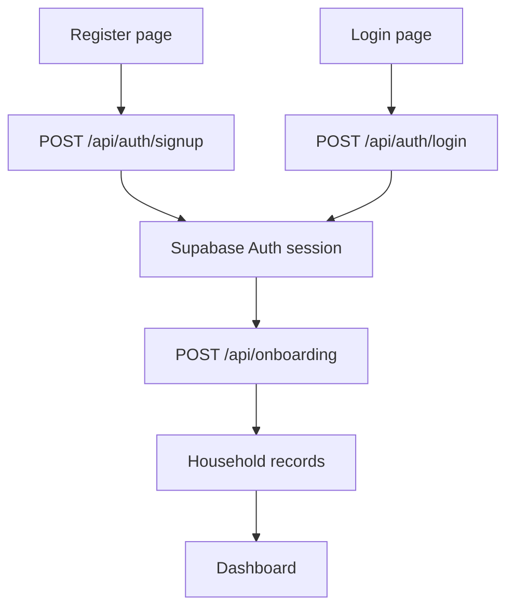

# KeepIt registration and login patch

This patch adds the complete registration, login, logout, session-checking and household-onboarding flow to the existing KeepIt Next.js application.

It is intended for the KeepIt project supplied in the final merged bundle. The files use their correct repository paths, so extracting the patch into the repository root replaces matching integration files instead of creating duplicate pages.

## How the flow works



Supabase stores the session in secure cookies. The dashboard then calls `/api/household` to load the signed-in user's household. The header calls `/api/auth/logout` when the user signs out.

## Files included

### Frontend

- `src/app/register/page.tsx`
- `src/app/login/page.tsx`
- `src/app/page.tsx`
- `src/components/layout/Header.tsx`

### Backend routes

- `src/app/api/auth/signup/route.ts`
- `src/app/api/auth/login/route.ts`
- `src/app/api/auth/logout/route.ts`
- `src/app/api/auth/me/route.ts`
- `src/app/api/onboarding/route.ts`
- `src/app/api/household/route.ts`
- `src/app/api/health/route.ts`

### Backend helpers

- `src/lib/supabase/config.ts`
- `src/lib/supabase/client.js`
- `src/lib/supabase/server.js`
- `src/lib/backend/household.ts`
- `src/lib/api.ts`
- `src/lib/types.ts`

### Configuration and verification

- `.env.example`
- `.gitignore`
- `supabase/schema.sql`
- `scripts/verify-backend.mjs`

## 1. Copy the patch into the repository

Make a safety branch before copying:

```powershell
git switch -c add-authentication
```

Place `KeepIt-auth-backend-patch.zip` in the folder containing `package.json`, then extract it directly into that folder:

```powershell
Expand-Archive -Path .\KeepIt-auth-backend-patch.zip -DestinationPath . -Force
```

The archive contains the correct `src/...`, `supabase/...` and `scripts/...` paths. Do not create a second `src` folder manually.

## 2. Install the authentication packages

```powershell
npm install @supabase/ssr @supabase/supabase-js
npm pkg set scripts.verify:backend="node scripts/verify-backend.mjs"
```

This updates `package.json` and `package-lock.json`. Commit both files, but never commit `node_modules`.

## 3. Configure Supabase

Create the local environment file:

```powershell
Copy-Item .env.example .env.local
```

Update `.env.local`:

```env
NEXT_PUBLIC_SUPABASE_URL=https://YOUR_PROJECT_ID.supabase.co
NEXT_PUBLIC_SUPABASE_PUBLISHABLE_KEY=YOUR_PUBLISHABLE_OR_ANON_KEY
NEXT_PUBLIC_ENABLE_DEMO_MODE=true
```

Never add a Supabase service-role key and never commit `.env.local`.

In the Supabase dashboard:

1. Open **SQL Editor**.
2. Copy the complete contents of `supabase/schema.sql`.
3. Run the SQL.
4. For a quick hackathon flow, open **Authentication → Providers → Email** and temporarily disable mandatory email confirmation.

## 4. Run and verify

Start the application:

```powershell
npm run dev
```

Open:

- <http://localhost:3000/register>
- <http://localhost:3000/login>
- <http://localhost:3000/api/health>

In a second terminal:

```powershell
npm run verify:backend
```

The live backend should report `database: reachable` and `mode: supabase`.

## 5. Test the full authentication flow

1. Register at `/register`.
2. Complete all four onboarding steps.
3. Confirm the app redirects to `/`.
4. Check Supabase for new rows in `profiles`, `households`, `household_members` and `bank_accounts`.
5. Use the profile menu to sign out.
6. Sign in again at `/login`.
7. Confirm the same household reloads.

## 6. Check and commit only the intended changes

Run:

```powershell
npm run build
git status
```

Stage the patch and dependency files:

```powershell
git add .env.example .gitignore
git add package.json package-lock.json
git add scripts/verify-backend.mjs
git add supabase/schema.sql
git add src/app/register src/app/login src/app/api/auth
git add src/app/api/onboarding src/app/api/household src/app/api/health
git add src/app/page.tsx src/components/layout/Header.tsx
git add src/lib/supabase src/lib/backend/household.ts src/lib/api.ts src/lib/types.ts
```

Review the staged file summary:

```powershell
git diff --cached --stat
```

Confirm that secret and generated files are not staged:

```powershell
git diff --cached --name-only | Select-String "node_modules|\.next|\.env\.local"
```

That command should return nothing.

Commit and push the branch:

```powershell
git commit -m "Add Supabase registration and login flow"
git push -u origin add-authentication
```

You can merge the `add-authentication` branch into `main` on GitHub after confirming that the build passes.

## Important overwrite note

The patch intentionally updates `src/app/page.tsx`, `Header.tsx`, `types.ts`, `api.ts` and `schema.sql` because those files connect authentication to the existing dashboard. If you edited any of them after downloading the final KeepIt bundle, compare the changes in VS Code before committing.

Do not create files such as `page-copy.tsx`, `page2.tsx` or a second Supabase client. Next.js routes must remain in the exact paths listed above.
